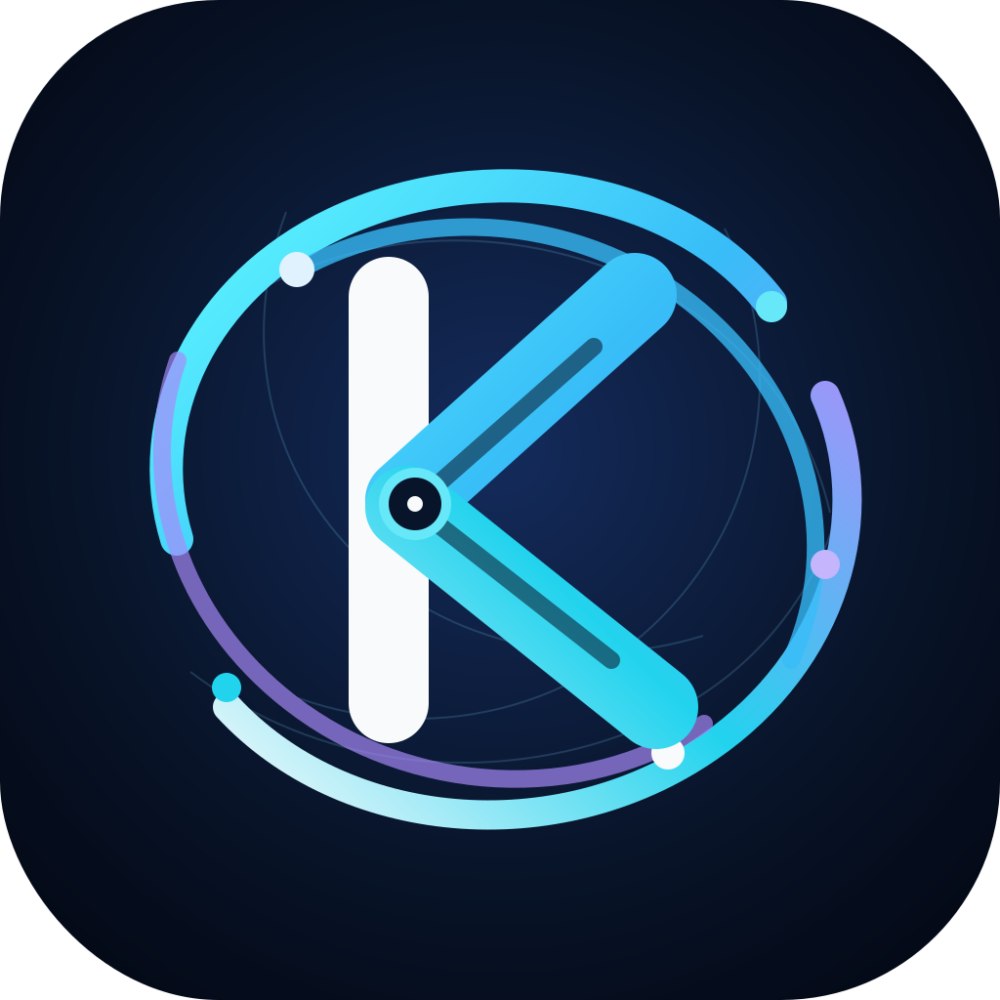
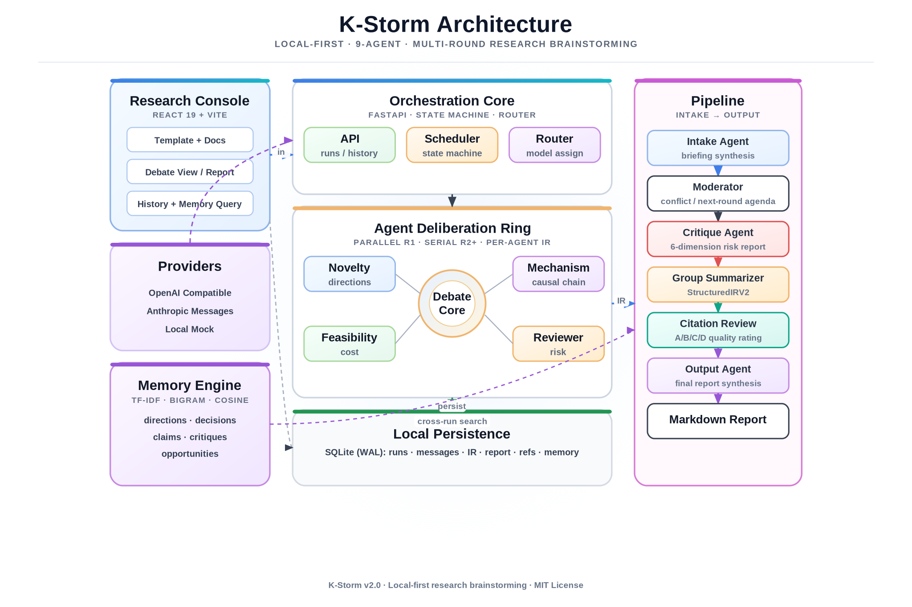

<div align="center">



# K-Storm

**本地多 Agent 科研选题头脑风暴**

把你的科研模板 + 上传文档 → 结构化 briefing → 可控多轮 Agent 讨论 → Markdown 选题报告

[](https://github.com/ShakeYoung/K-Storm/blob/main/LICENSE)
[](https://github.com/ShakeYoung/K-Storm)
[](https://www.python.org/)
[](https://react.dev/)
[](https://fastapi.tiangolo.com/)

[中文文档](./README.zh-CN.md) | [English](./README.md)

</div>

---

## ⚡ 项目概述

K-Storm 是一个**完全本地运行**的科研选题多 Agent 头脑风暴工具。多个 AI Agent（Novelty、Mechanism、Feasibility、Reviewer）围绕你的研究问题进行结构化多轮讨论，最终生成可直接用于开题报告或组会讨论的 Markdown 报告。

**零云端依赖** — 内置 mock provider 开箱即用，接入任意 OpenAI 兼容或 Anthropic API 即可解锁真实 Agent 推理。

## 🪄 讨论模式（V1.7）

| 模式 | Agent 数 | 轮次 | 适用场景 |
|:--|:--|:--|:--|
| **完整讨论** | 4 + Moderator | 1–5 | 全面头脑风暴，生成完整 IR 和报告 |
| **聚焦小节** | 自选 2–3 | 1–2 | 针对特定问题的深度讨论 |
| **快速探测** | 1 | 1 | 对单个问题做快速可行性判断 |
| **记忆查询** | 自选 | 1–5 | 基于历史讨论的上下文启动新讨论 |

<details>
<summary><b>🧠 记忆查询说明</b></summary>

选择一条已完成的历史讨论，读取其记忆上下文（已知事实、未知问题、约束条件、机会点），选择 Agent 和轮次，输入新问题后启动新讨论。新讨论会继承源 Run 的 briefing 和 IR 作为记忆注入，结果与源 Run 通过 `source_run_id` 关联。

</details>

## 🧭 科研阶段（V1.7）

K-Storm 根据你填写的模板信息密度，自动判断当前处于科研周期的哪个阶段，并调整所有 Agent 的输出侧重点和最终报告结构。你也可以手动覆盖自动判断结果。

| 阶段 | 触发条件 | 输出变化 |
|:--|:--|:--|
| **选题探索** | 信息较少，尚无明确课题 | Agent 提出候选课题和方向建议 |
| **方案收敛** | 已有明确课题 + 实验设计 | Agent 围绕当前课题推进和完善，不重新推荐新课题 |
| **结果诊断** | 输入中包含实验数据或结果 | Agent 解释结果、定位瓶颈、设计补充实验 |
| **转向评估** | 输入中包含卡住、偏差、失败等转向信号 | Agent 评估是否需要修正当前路线或转向备选方向 |

<details>
<summary><b>自动推断机制</b></summary>

推断引擎按以下优先级检查模板字段：

1. **结果信号** — 数值型数据（倍数、浓度、样本量、p 值等）→ `结果诊断`
2. **设计成熟度** — 对照、重复、流式、Western blot、动物模型等实验术语密度 ≥ 5 → `结果诊断`
3. **转向信号** — "转向""偏差""换题""不成立""失败""卡住""瓶颈""止损"等关键词 ≥ 2 → `转向评估`
4. **方案成熟度** — 平台/约束/目标产出等字段填充 ≥ 3 且已有基础 > 80 字 → `方案收敛`
5. **默认** → `选题探索`

检测到的阶段以**阶段标签 + 阶段目标**的形式注入每个 Agent 的 prompt，并影响最终报告结构：
- 选题探索 → 报告主体为「推荐选题 Top 3-5」
- 其他阶段 → 报告主体围绕当前课题推进/诊断/修正，必要时在末尾附上转向建议

</details>

## ✨ 核心能力

- 📋 **结构化模板填写** — 研究方向、背景、已有基础、约束条件、研究目标
- 📎 **文档上传** — 支持 design / experiment-data 类型标注和逐文档注释
- 🧩 **大文档混合 intake** — 小规模上传走全文 intake；大规模上传自动切换为“逐文档摘要提取 + 预算化整合”
- 🤖 **4 个讨论 Agent** — Novelty（创新性）· Mechanism（机制深挖）· Feasibility（可行性）· Reviewer（审稿质疑）
- 🎯 **Moderator** — 汇总冲突点、遗漏点，生成下一轮问题清单
- 📊 **结构化 IR** — 候选方向、证据链、批判点、风险与替代路线
- 📝 **最终 Markdown 报告** — 开题/组会可用，支持逐区域复制
- 📚 **外部论据** — Agent 引用论文/博客/数据集；二级提取 + 独立论据页面 + 分组导出
- 🔄 **运行管理** — 停止分析、从失败位置继续、从头重跑
- 🗂️ **历史记录** — 搜索、状态筛选、打开历史讨论、删除
- 📤 **多格式导出** — MD/PDF、JSON Bundle、外部论据导出
- ✅ **输出完整性校验** — 结束标记 + 结构化检查防止半截输出进入下一流程，校验失败自动重试
- ⚙️ **按 Agent 分配模型** — mock / OpenAI / Anthropic 混配

## 🏗️ 系统架构

K-Storm 的核心是一个本地运行的研究编排系统：React 控制台负责输入、讨论与报告呈现，FastAPI 后端维护运行状态机，并按 Agent 位置路由到不同模型。讨论组由四个互补角色构成：

- **Novelty Agent**：提出新方向与差异化切入点
- **Mechanism Agent**：检查机制链条与因果解释
- **Feasibility Agent**：评估实验资源、成本和可执行性
- **Reviewer Agent**：模拟审稿质疑，暴露风险与薄弱环节

<div align="center">

</div>

完整架构文档见 [docs/ARCHITECTURE.zh-CN.md](docs/ARCHITECTURE.zh-CN.md)，包含运行流程时序图、后端模块图、数据流图和 Agent 编排结构。

<details>
<summary><b>🔄 运行流程</b></summary>

```text
模板 + 上传文档
  ↓
（大规模上传时）逐文档摘要提取 + 预算控制
  ↓
入口 Agent → 高密度 briefing
  ↓
第 1 轮（可选并行）
  ↓
Moderator → 冲突/遗漏汇总 + 下一轮问题清单
  ↓
第 2 轮起串行反驳/修正
  ↓
各 Agent → IR 要点摘要（压缩）
  ↓
结构化 IR → 候选方向 + 证据链 + 风险
  ↓
出口 Agent → 最终 Markdown 报告
```

</details>

<details>
<summary><b>📁 项目结构</b></summary>

```text
backend/
  app/
    agents/              Agent 定义与注册
    model_providers/     Mock / OpenAI / Anthropic 供应商
    orchestrator/        运行执行状态机
    schemas/             Pydantic 模型
    storage/             SQLite 数据层
    static/              早期独立 UI
    main.py              FastAPI 入口
frontend/
  src/
    main.jsx             React 应用
    styles/
      app.css            样式表
docs/
  ARCHITECTURE.zh-CN.md       架构文档
  K-STORM-ROADMAP.zh-CN.md    演进路线图
```

</details>

## 🚀 快速启动

### 环境要求

- **Python** 3.10+
- **Node.js** 18+（用于 Vite 前端）

### 1. 启动后端

```bash
cd backend
python3 -m venv .venv
source .venv/bin/activate   # Windows: .venv\Scripts\activate
pip install -r requirements.txt
uvicorn app.main:app --reload --port 8000
```

默认使用 **mock provider**，无需任何 API Key。

### 2. 启动 React 前端（推荐）

Vite 前端包含完整的 V1.7 功能：

```bash
cd frontend
npm install
npm run dev
```

打开 <http://localhost:5173>。

> 后端同时提供一版免构建 UI：<http://127.0.0.1:8000>（早期版本，不含 V1.7 新功能，适合没有 npm 的环境快速试用）。

### 3. 配置模型（可选）

浏览器模型设置支持以下供应商：

| 供应商类型 | 示例 |
|:--|:--|
| OpenAI Compatible | DeepSeek、DashScope、OpenRouter、Ollama、SiliconFlow |
| OpenAI Responses | OpenAI |
| Anthropic Messages | Claude |
| Coding Plan | Kimi、百炼、火山引擎 |

API Key 仅保存在浏览器 `localStorage` 中，不会写入磁盘或 SQLite。

<details>
<summary><b>⚙️ 环境变量配置（备选方案）</b></summary>

```bash
cp .env.example .env
```

```bash
KS_MODEL_PROVIDER=mock        # 默认，无需 Key
# KS_MODEL_PROVIDER=openai
# OPENAI_API_KEY=sk-your-key
# OPENAI_MODEL=gpt-4.1-mini
```

也可以在浏览器"模型设置"中直接配置，无需编辑 .env。

</details>

<details>
<summary><b>🔗 默认供应商地址</b></summary>

| 供应商 | Base URL |
|:--|:--|
| Kimi Coding Plan | `https://api.kimi.com/coding/v1` |
| 百炼 Coding Plan | `https://coding.dashscope.aliyuncs.com/v1` |
| 火山引擎 Coding Plan | `https://ark.cn-beijing.volces.com/api/coding/v3` |
| DeepSeek | `https://api.deepseek.com/v1` |
| DashScope | `https://dashscope.aliyuncs.com/compatible-mode/v1` |
| OpenAI | `https://api.openai.com/v1` |
| OpenRouter | `https://openrouter.ai/api/v1` |
| Ollama | `http://127.0.0.1:11434/v1` |
| MiniMax | `https://api.minimax.io/v1` |
| SiliconFlow | `https://api.siliconflow.cn/v1` |

</details>

## 🔧 技术栈

| 层级 | 技术 |
|:--|:--|
| 前端 | React 19 + Vite |
| 后端 | FastAPI |
| 数据库 | SQLite（WAL 模式） |
| Agent 编排 | 自研状态机 |
| 模型接入 | Mock（默认）· OpenAI Compatible · Anthropic |

## 📡 API 简表

```text
POST   /api/runs                          创建新运行
GET    /api/runs/{run_id}                  获取运行状态和数据
GET    /api/runs/{run_id}/messages         获取讨论消息
GET    /api/runs/{run_id}/report           获取最终报告
POST   /api/runs/{run_id}/rerun            从头重跑
POST   /api/runs/{run_id}/resume           从失败位置继续
POST   /api/runs/{run_id}/cancel           停止运行
POST   /api/runs/{run_id}/references       提取或更新外部论据
POST   /api/memory/query                   记忆查询
GET    /api/history                        历史记录列表
POST   /api/history/delete                 删除历史记录
POST   /api/models/discover                从供应商发现模型
```

## 📜 许可证

[MIT](LICENSE) © 2026 apech
