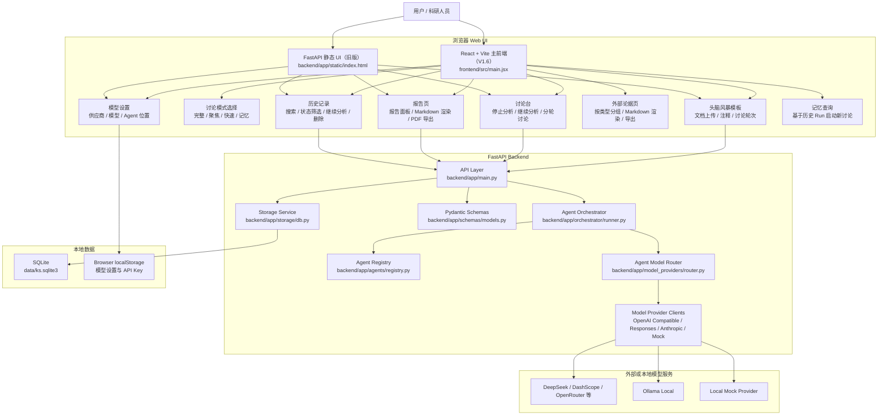
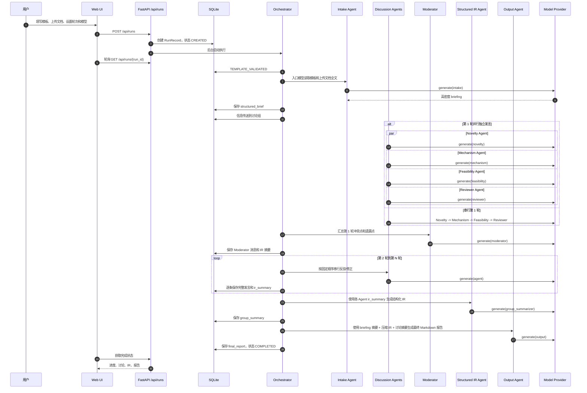
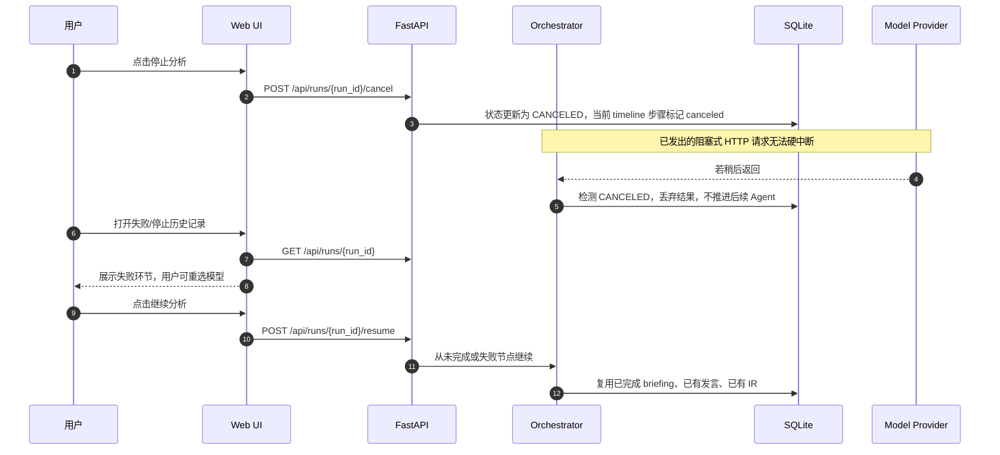
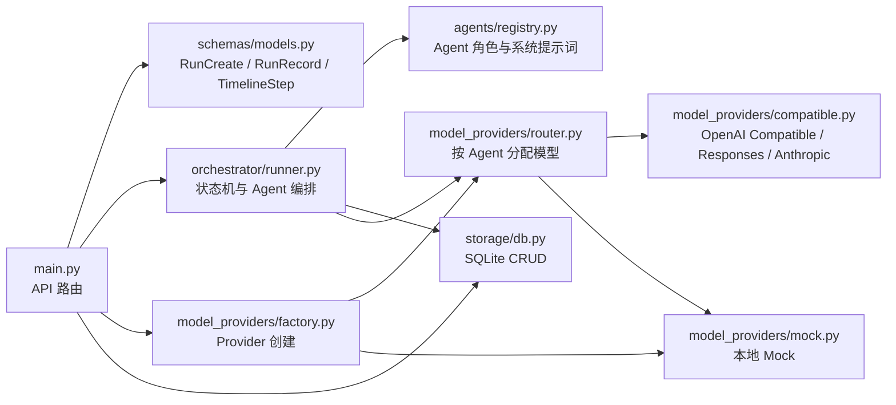
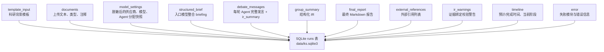
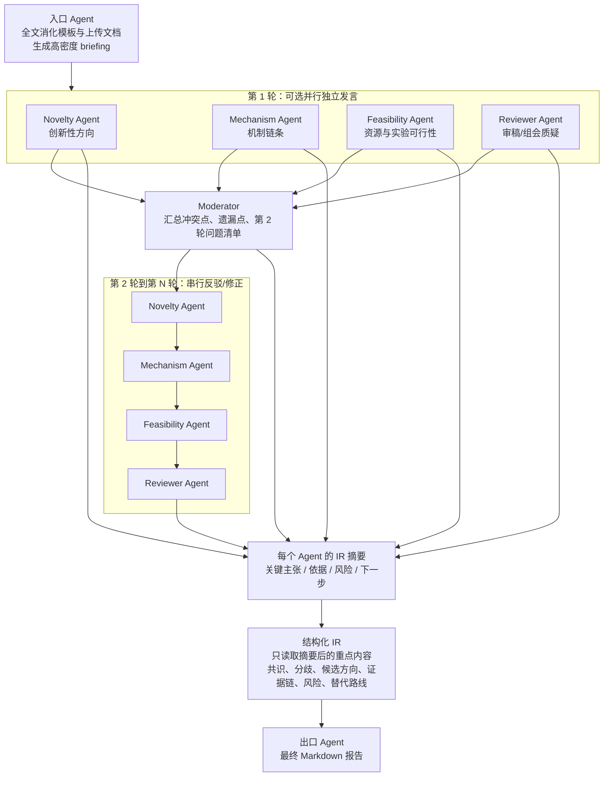
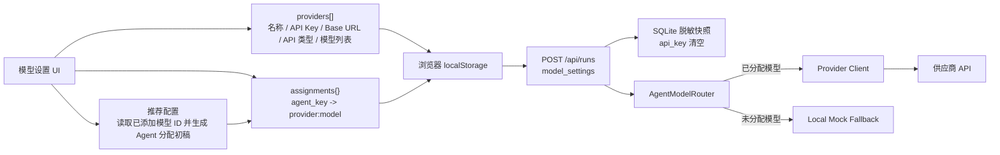
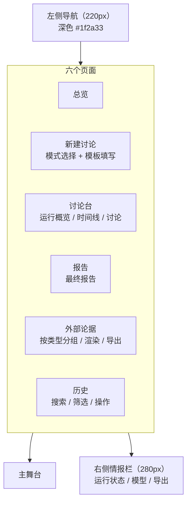

# K-Storm 项目架构图

K-Storm 是一个本地运行的科研选题多 Agent 头脑风暴系统。当前版本为 V1.6，采用轻量 Web 架构：FastAPI 提供后端 API，React + Vite 作为主前端，SQLite 用于本地历史记录。

## 1. 总体架构



## 2. 运行流程



停止/继续流程：



## 3. 后端模块图



## 4. 数据流与持久化



说明：

- `structured_brief.intake_synthesis` 保存入口模型对模板和上传文档的高密度整合。
- `debate_messages` 保存每个 Agent 的原始 Markdown 发言，并保存面向结构化 IR 的 `ir_summary`。
- `group_summary` 当前语义为结构化 IR，而不是普通聊天式总结。结构化 IR 是中间产物，不对用户直接展示，仅在打包导出中包含。
- `final_report` 由出口 Agent 生成。为降低超时概率，出口阶段不再接收完整讨论全文，而是使用 briefing 摘要、压缩后的结构化 IR 和讨论摘要。
- `external_references` 从各 Agent 的讨论发言中提取的外部论据（论文、博客、数据集等），支持显式小节提取和正则全文 fallback。记忆查询模式自动合并源 Run 的已有引用。
- `ir_warnings` 记录结构化 IR 证据绑定校验的告警信息（如悬空引用、空绑定、仅泛化引用等）。
- `timeline` 保存每个阶段的状态、预计完成时间、最终完成时间和失败信息。
- `model_settings` 保存运行时模型位置快照，但 API Key 会被清空，不写入 SQLite。

## 5. Agent 编排结构



说明：

- 第 1 轮并行时，Moderator 读取第 1 轮讨论组 Agent 的完整发言，以便充分识别冲突和遗漏。
- 结构化 IR 不再读取所有完整发言，而是读取各 Agent 在发言末尾提供的 `给结构化 IR 的要点摘要`。
- 串行模式从第 1 轮开始同样要求每个 Agent 产出 IR 摘要，因此后续 IR 阶段不会随轮次线性吞下完整大段文本。

当前 Agent 位置可在 Web UI 中分别绑定不同模型：

- 入口 Agent：推荐长上下文模型，用于消化完整模板和上传文档。
- Novelty Agent：推荐速度较快、发散能力强的模型。
- Mechanism Agent：推荐推理稳定、机制链条表达强的模型。
- Feasibility Agent：推荐成本适中、执行细节可靠的模型。
- Reviewer Agent：推荐批判性和长文本能力强的模型。
- Moderator：推荐总结和对比能力较强的模型。
- 结构化 IR：推荐结构化输出稳定的模型。
- 出口 Agent：推荐中文写作稳定、长输出可靠的模型。

## 6. 模型设置与调用



当前支持的 API 类型：

- `OpenAI Compatible`
- `OpenAI Responses`
- `Anthropic Messages`
- `Local Mock`

模型设置中的 API Key 只保存在浏览器 `localStorage`。运行创建时，后端会把模型设置脱敏后写入 SQLite：保留供应商、模型列表和 Agent 分配关系，清空 API Key，便于后续分析失败模块。

## 7. 前端呈现结构（V1.6）



V1.6 UI 特性：

- 三栏布局：深色左导航 220px + 主舞台弹性宽度 + 右侧情报栏 280px
- 六个页面通过左侧导航切换，无路由，CSS class 控制
- 讨论模式选择器：四种模式的参数区动态联动
- Agent 卡片按角色显示不同颜色顶边框，内容 markdown 渲染
- 按轮次 Tab 切换查看讨论内容
- 结构化 IR 对用户隐藏（中间产物），仅在打包导出中包含
- 外部论据页：按类型分组、markdown 渲染、MD/PDF 导出
- 历史记录支持搜索和状态筛选
- 导出统一 MD/PDF 选择器（DownloadMenu 组件），覆盖报告、打包、论据导出
- 从总览/历史打开正在运行的讨论时，自动恢复 polling，保持停止按钮可用
- COMPLETED 记录确认后跳转新建页预填模板
- 记忆查询面板：选择历史 Run → 读取记忆 → 配置参数 → 启动新讨论
- 响应式断点：≤1280px 隐藏右栏，≤900px 隐藏左导航

Markdown 渲染器支持：标题、有序/无序列表、粗体、行内代码、引用块、分隔线、表格、fenced code block。

## 8. 当前目录结构

```text
K-Storm/
  backend/
    app/
      agents/
        registry.py
      model_providers/
        base.py
        compatible.py
        factory.py
        mock.py
        openai_provider.py
        router.py
      orchestrator/
        runner.py
      schemas/
        models.py
      static/
        index.html
      storage/
        db.py
      main.py
    requirements.txt

  frontend/
    src/
      main.jsx
      styles/app.css
    package.json
    vite.config.js

  data/
    ks.sqlite3

  README.md
  README.zh-CN.md
```

## 9. 项目状态与后续方向

### V1.6 已完成

- 四种讨论模式（完整/聚焦/快速/记忆）
- 记忆查询：基于历史 Run 上下文启动新讨论
- 三栏实验台 UI（深色左导航 + 主舞台 + 情报栏）
- 六个页面：总览、新建讨论、讨论台、报告、外部论据、历史
- 停止/继续/从头重跑
- 统一 MD/PDF 导出选择器（DownloadMenu 组件）
- 外部论据系统：Agent 角色化引用要求、二级提取、分组展示、MD/PDF 导出
- 证据绑定校验（基础版：悬空引用、空绑定、仅泛化引用检测）
- 结构化 IR 对用户隐藏，仅在打包导出中包含
- 从总览/历史打开运行中的讨论时自动恢复 polling
- COMPLETED 记录确认后预填模板重跑

### 待开发

- 证据语义审查 Agent（待实验数据后评估）
- Critique 独立阶段
- 记忆检索引擎（TF-IDF / embedding）
- 模式升级链路（Quick → Focused → Full）
- 预置 Panel 模板
- SSE 实时推送
